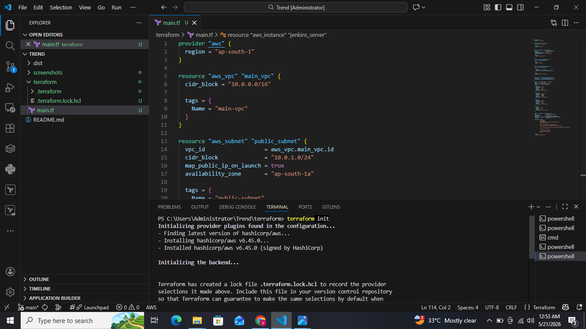
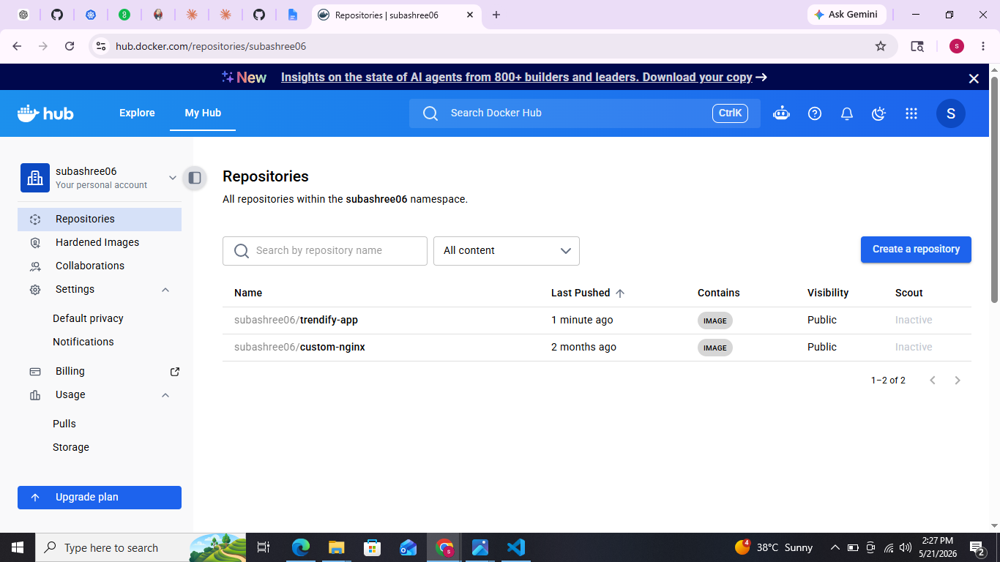
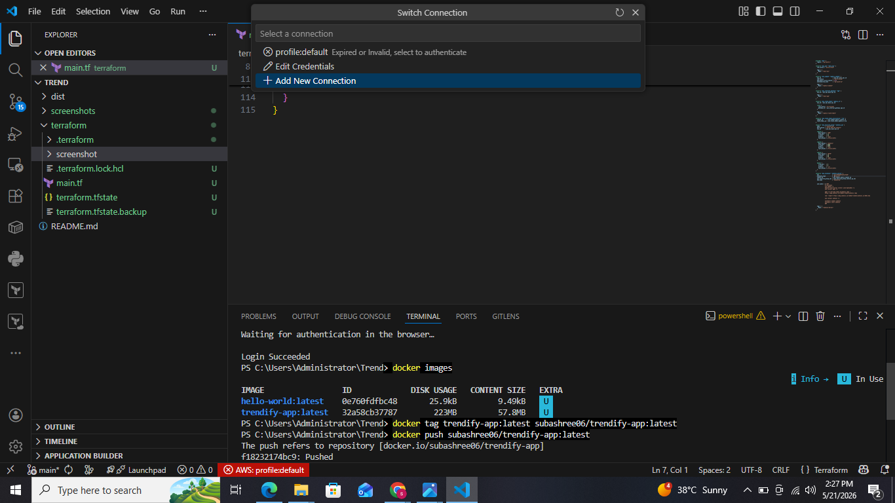
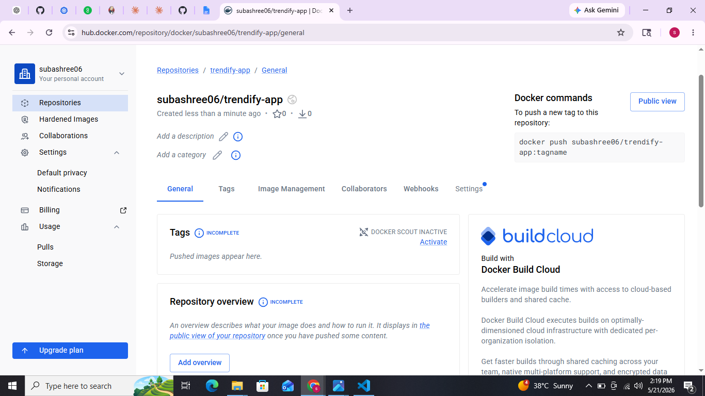

# 🚀 Trend Deployment — DevOps Project

## 📌 Project Overview
This repository contains the DevOps pipeline for the Trend application including Infrastructure Provisioning, Containerization, and Kubernetes Deployment.

---

## ✅ Steps Completed
- Infrastructure Provisioning using Terraform
- Containerization using Docker
- Kubernetes Deployment on AWS EKS

---

## 🚀 Deployment Phases

### Phase 1 — Clone Repository

```bash
git clone https://github.com/Vennilavanguvi/Trend.git
cd Trend
```

#### Application Repository Screenshots
.png)
.png)

---

### Phase 2 — Docker (Build & Run Locally)

#### 🎯 Objective
Dockerize the React application for consistent deployment.

#### 🛠 Steps
- Create a Dockerfile
- Build Docker image
- Run container using Docker

#### 🔧 Commands

```bash
# Build image
docker build -t trend-app .

# Run on port 3000
docker run -d -p 3000:3000 --name trend-app trend-app

# OR use docker-compose
docker-compose up
```

✅ Open browser → http://localhost:3000

#### Docker Screenshots
.png)
.png)
.png)

---

### Phase 3 — Terraform Infrastructure (AWS)

#### 🎯 Objective
Provision AWS infrastructure using Terraform.

#### 🏗 Resources Created
- VPC
- Subnets
- Security Groups
- IAM Roles
- EC2 Instance (Jenkins Server)
- AWS EKS Cluster

#### 🔧 Commands

```bash
terraform init
terraform plan
terraform apply
```

#### Terraform Screenshots

.png)
.png)
.png)
.png)
.png)

---

### Phase 4 — DockerHub (Push Image)

#### 🎯 Objective
Create DockerHub repository and push Docker image.

#### 🛠 Steps
- Create DockerHub repository
- Push Docker image

#### 🔧 Commands

```bash
docker login
docker tag trendify-app:latest subashree06/trendify-app:latest
docker push subashree06/trendify-app:latest
```

#### DockerHub Screenshots




---

### Phase 5 — Kubernetes (AWS EKS)

#### 📌 Objective
Deploy application in Kubernetes cluster on AWS EKS.

#### 🧱 Steps

**1. Setup EKS Cluster**

```bash
eksctl create cluster --name trend-cluster --region us-east-1 --version 1.31 --nodegroup-name linux-nodes --node-type t3.micro --nodes 1 --managed
```

.png)

---

**2. Create Deployment YAML**

**3. Create Service YAML (LoadBalancer)**

#### 📄 Files
- `deployment.yaml`
- `service.yaml`

---

**4. Deploy**

```bash
kubectl apply -f deployment.yaml
kubectl apply -f service.yaml
```

**5. Verify**

```bash
kubectl get pods
kubectl get svc
```

#### Kubernetes Screenshots
.png)
.png)

---

**6. Access Application**

🌐 http://a823951091d3146818a89f5f0d989b76-72434611.us-east-1.elb.amazonaws.com/

#### Application Screenshots
.png)
.png)
.png)
.png)

---